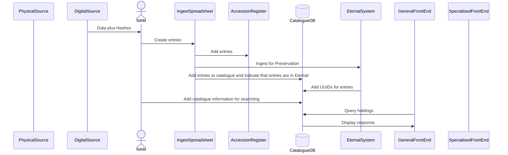
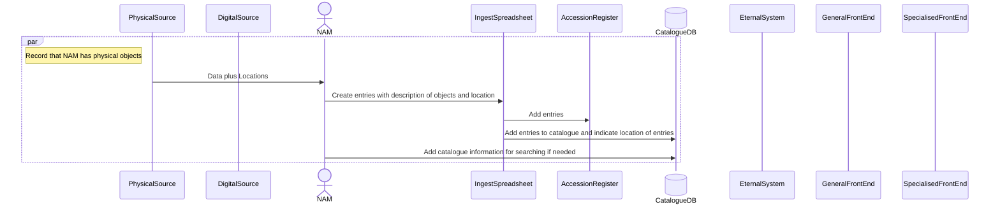
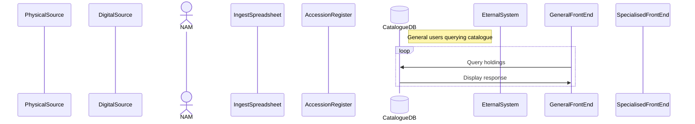
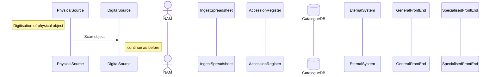
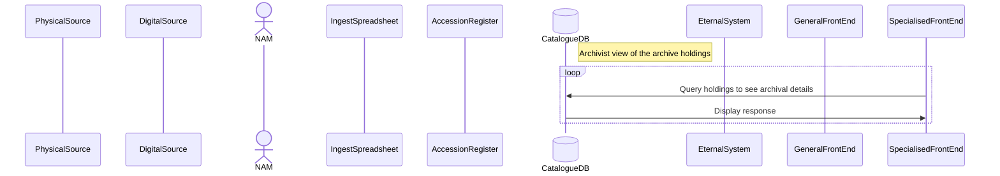
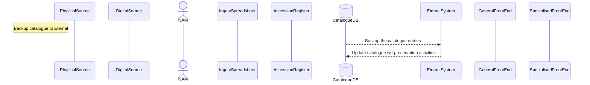

# NAM interactions
## Normal ingest of digital objects
Much of this, apart from the Catalogue, is documented in the Records Management  document.

## Dealing with physical objects

## Users querying the catalogue
There may be fields and objects which general users are not allowed to see or download.

Paying via a special payment system may allow such users additional access.

## Digitisation of hysical objects
Papers can be scanned as PDFs and 3-D objects as complex file type.

## Archivists querying the catalogue
Archivists will be able to see additional details

## Synchronising the catalogue with Eternal
Besides normal backups it would be sensible to synchronise the CatalogueDB with Eternal

