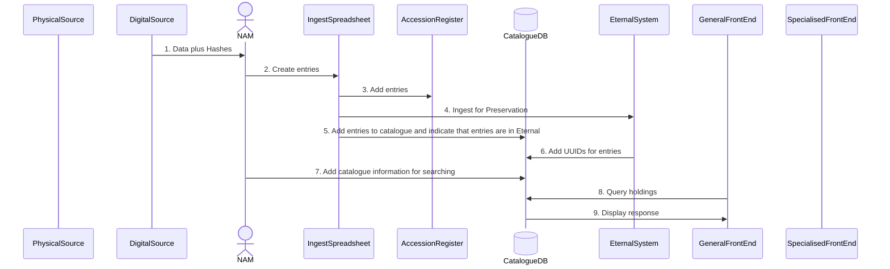
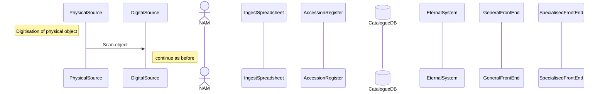
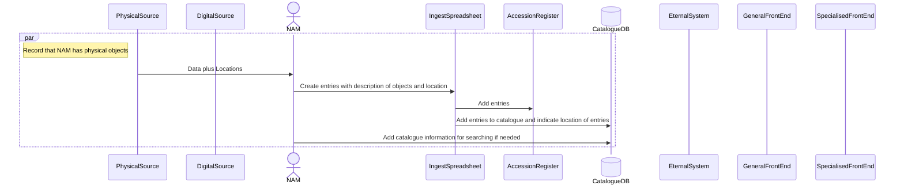
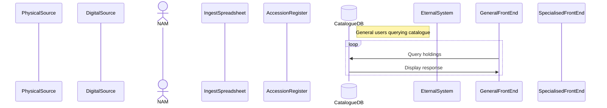
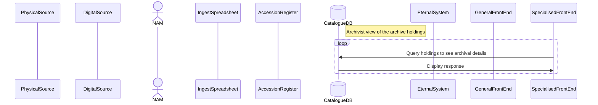
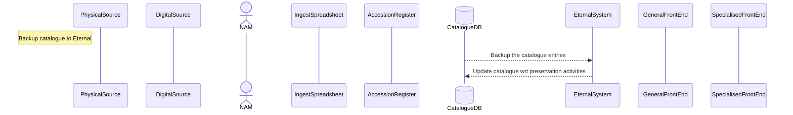

# NAM interactions
## Normal ingest of digital objects
Much of this, apart from the Catalogue, is documented in the Records Management  document.

The Access Register could be part of the CatalogueDB. Digital Objects which have been uploaded to Eternal would have this flagged in the appropriate field, to distinguish objects in Eternal from other objects e.g.
1. objects which are waiting for additional information to be aquired before they can be uploaded to Eternal
2. Objects which are not suitable for preservation, and so will not be uploaded to Eternal.

The steps can be described as follows:
1. The source of the digital objects sends to NAM the digital objects plus the spreadsheet of hashes created using the small command line provided (assuming a Windows PC) either by sending by email or using OwnCloud
2.  NAM then creates the ingest spreadsheet which includes all the information needed for preservation. The spreadsheet could also include the catalogue information which Eternal may or may not import
3. The spreadsheet entries are appended to the Accession Register - this ensure that no matter what else happens, there is a record that these digital objects have been accepted by NAM.
4. The digital objects are ingested into Eternal for preservation, accompanied by the spreadsheet which adds information needed to create the AIP.
5. The spreadsheet entries are appended to the CatalogueDB database. Note that the Accession Register may also be part of this database. A flag is set to indicate that the digital objects have been ingested. The database should be accessible via one or more web interfaces.
6. When Eternal has created the AIPs, the UUID, which identifies each AIP, is added to the CatalogueDB so that there is a link between the catalogue and the AIPs.
7. Additional information may be added to the CatalogueDB by NAM in order to make the information more easily searchabl. TNA uses a 7 level set of entries.  Note that a full text search is possible locally but this will require that SOLR, for example, is run locally to index all the digital objects as well as the "metadata".
8. The CatalogueDB can be used to query the contents of NAM
9. The CatalogueDB returns results
  

## Digitisation of physical objects
Papers can be scanned as PDFs and 3-D objects stored in a more complex file.

Papers may be kept after digitisation e.g. old manuscripts. In this case that  physical paper will be treated as described below, and linked to the digital scan.

## Dealing with physical objects
Physical objects which have not yet been, or which may never be, scanned,  are recorded in the Accession Register and the CatalogueDB.

Because these are physical objects they have a physical location e.g. the records room at NAM, with rack and shelf location or even a geographical location such as an address or GPS location.

## Users querying the catalogue
There may be fields and objects which general users are not allowed to see or download.

Paying via a special payment system may allow such users additional access.

## Archivists querying the catalogue
Archivists will be able to see additional details

## Synchronising the catalogue with Eternal
Besides normal backups it would be sensible to synchronise the CatalogueDB with Eternal

Use https://www.mermditor.dev/editor for PDF

